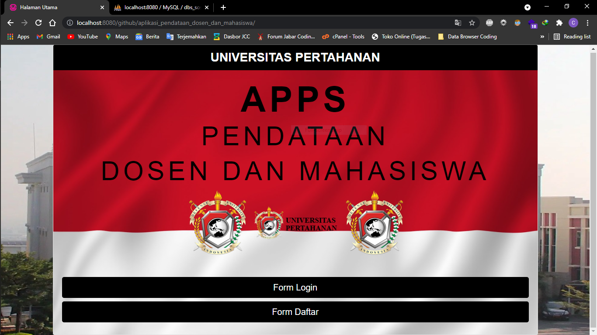
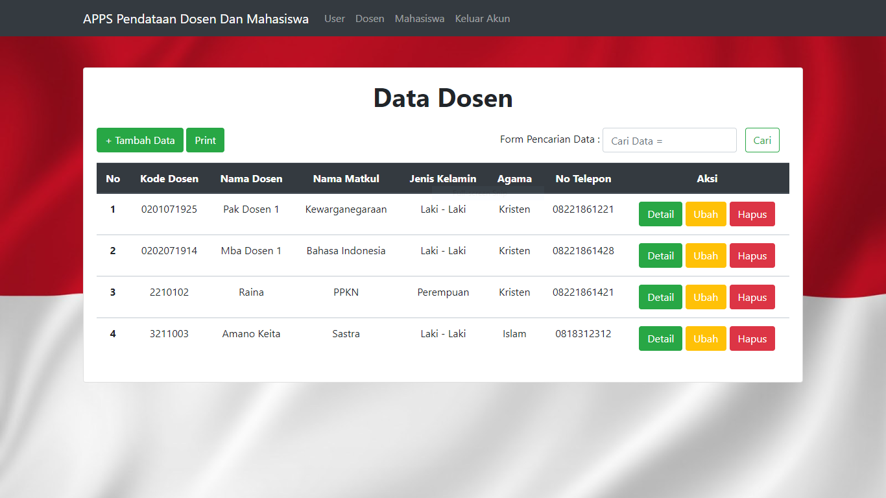

## Aplikasi Pendataan Dosen Dan Mahasiswa Berbasis Web Sederhana

## Fitur Aplikasi

- Login 
- Register 
- Logout 
- Halaman Utama  
  A. Data Users 
- Tambah Data (Data Users) 
- Ubah Data (Data Users) 
- Hapus Data (Data Users) 
- Detail Data (Data Users) 
- Cari Data (Data Users) 
- Print Data (Data Users)  
  B. Data Dosen 
- Tambah Data (Data Dosen) 
- Ubah Data (Data Dosen) 
- Hapus Data (Data Dosen) 
- Detail Data (Data Dosen) 
- Cari Data (Data Dosen) 
- Print Data (Data Dosen)  
  C. Data Mahasiswa 
- Tambah Data (Data Mahasiswa) 
- Ubah Data (Data Mahasiswa) 
- Hapus Data (Data Mahasiswa) 
- Detail Data (Data Mahasiswa) 
- Cari Data (Data Mahasiswa) 
- Print Data (Data Mahasiswa)  

## Fitur Role Atau Pembatasan Menu Untuk Setiap Users

- Admin
- Magang
- Pembimbing

## Aplikasi Screenshot

## Alat Yang Digunakan Untuk Membuat Web :

A. Hardware :
Laptop Aspire E1-472G. Speaksifikasi :

- Ram : 4GB DD3 L Memory
- Prosesor : Intel Core i5-4200U 1.6 GHz with Turbo Boost up to 2.5 GHz
- Tipe System : 64 bit
- VGA : NVIDIA GEFORCE GT 720M with 2GB Dedicated VRAM
- SSD : 128 GB

B. Software :

- XAMPP
- Sublime Text 3
- Bootstrap 4
- PHP 7.2
- MYSQL
